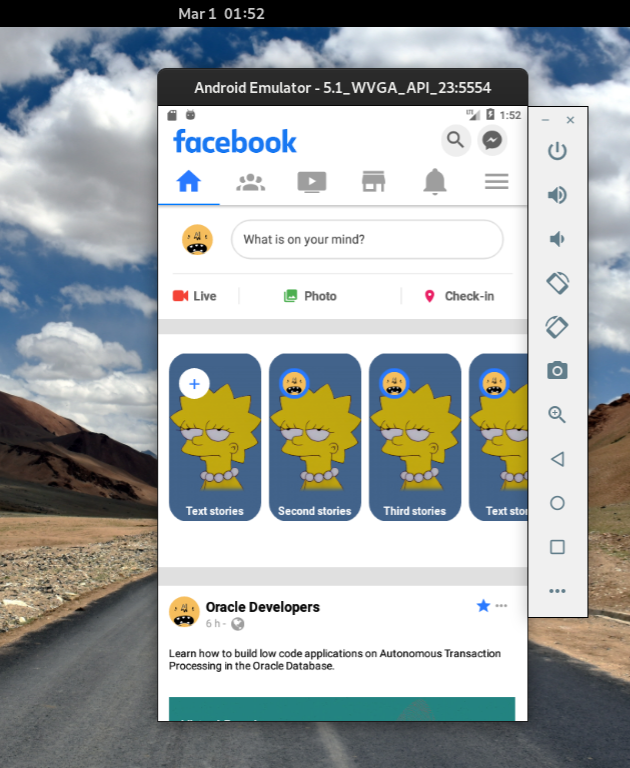

# Testando ReactNavigation v5

Testando como implementar essa nova versão da biblioteca que infelizmente muda a cada update.

## Tela construida Dashboard do Facebook

Para fazer essa implementação foi feito uma copia da tela de dashboard do facebook

    

